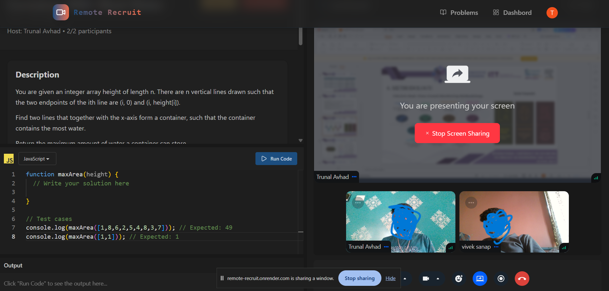
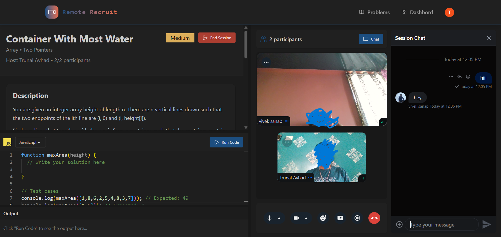

# Remote Recruit

A comprehensive video interview platform built with the MERN stack, enabling recruiters and candidates to conduct real-time technical interviews with integrated code execution and live video/chat capabilities.

## 🚀 Live Demo

**Deployed on Render:** [Remote Recruit](https://remote-recruit.onrender.com)

## ✨ Features

- **13 Built-in Coding Problems**: Curated collection of technical interview questions across different difficulty levels
- **Real-time Video Interviews**: Seamless video communication powered by Stream
- **Screen Sharing**: Share your screen during interviews for better collaboration
- **Live Chat Integration**: Real-time messaging between interviewer and candidate
- **Code Editor**: Monaco Editor integration for live code editing and syntax highlighting
- **Code Execution**: Execute and test code snippets with real-time output
- **Session Management**: Create, track, and manage interview sessions
- **Practice Problems**: Dedicated problem page to practice coding problems without creating sessions
- **User Authentication**: Secure authentication using Clerk
- **Session Persistence**: Store and fetch session data with MongoDB Atlas
- **Dashboard**: View active sessions, recent interviews, and interview stats
- **Responsive Design**: Mobile-friendly interface with Tailwind CSS

## 🛠️ Tech Stack

### Frontend
- **React 19** - UI library
- **Vite** - Fast build tool
- **Tailwind CSS** - Styling
- **Clerk** - Authentication
- **Stream Chat & Video SDK** - Real-time communication
- **Monaco Editor** - Code editing
- **React Query** - Data fetching
- **React Router** - Navigation
- **Axios** - HTTP client

### Backend
- **Node.js** - Runtime environment
- **Express 5** - Web framework
- **MongoDB (Atlas)** - Database
- **Mongoose** - MongoDB ODM
- **Clerk SDK** - Authentication verification
- **Stream SDK** - Video and chat backend
- **Inngest** - Workflow orchestration for session creation
- **CORS** - Cross-origin resource sharing

## 📋 Prerequisites

- Node.js (v16 or higher)
- npm or yarn
- MongoDB Atlas account
- Clerk account
- Stream account
- Inngest account

## 🔧 Installation & Setup

### 1. Clone the repository
```bash
git clone <[Repo](https://github.com/TrunalAvhad/remote-recruit)>
cd VcInterviewPlatform
```

### 2. Environment Variables

Create `.env` files in both `backend` and `frontend` directories.

**Backend `.env`:**
```
PORT=5000
MONGODB_URI=your_mongodb_atlas_connection_string
CLERK_SECRET_KEY=your_clerk_secret_key
CLERK_PUBLISHABLE_KEY=your_clerk_publishable_key
STREAM_API_KEY=your_stream_api_key
STREAM_API_SECRET=your_stream_api_secret
INNGEST_EVENT_KEY=your_inngest_event_key
INNGEST_SIGNING_KEY=your_inngest_signing_key
```

**Frontend `.env.local`:**
```
VITE_CLERK_PUBLISHABLE_KEY=your_clerk_publishable_key
VITE_STREAM_API_KEY=your_stream_api_key
VITE_API_BASE_URL=http://localhost:5000
```

### 3. Install Dependencies

```bash
# Root installation
npm install

# Backend
cd backend
npm install

# Frontend
cd ../frontend
npm install
```

## 🚀 Running Locally

### Development Mode

**Terminal 1 - Backend:**
```bash
cd backend
npm run dev
```
Backend runs on `http://localhost:5000`

**Terminal 2 - Frontend:**
```bash
cd frontend
npm run dev
```
Frontend runs on `http://localhost:5173`

### Build for Production

```bash
# From root directory
npm run build
```

## � Screenshots

### Interview Session in Action


### Live Interview Session with Code Editor


## �📊 Project Structure

```
VcInterviewPlatform/
├── backend/
│   ├── src/
│   │   ├── server.js              # Express server entry point
│   │   ├── controllers/           # Route handlers
│   │   │   ├── chatController.js
│   │   │   └── sessionController.js
│   │   ├── models/                # MongoDB schemas
│   │   │   ├── User.js
│   │   │   └── Session.js
│   │   ├── routes/                # API routes
│   │   │   ├── chatRoutes.js
│   │   │   └── sessionRoutes.js
│   │   ├── middleware/            # Express middleware
│   │   │   └── protectRoute.js   # Clerk auth verification
│   │   └── lib/                   # Utilities
│   │       ├── db.js              # MongoDB connection
│   │       ├── env.js             # Environment config
│   │       ├── inngest.js         # Inngest setup
│   │       └── stream.js          # Stream SDK config
│   └── package.json
│
├── frontend/
│   ├── src/
│   │   ├── App.jsx                # Main app component
│   │   ├── main.jsx               # Entry point
│   │   ├── pages/                 # Page components
│   │   │   ├── HomePage.jsx
│   │   │   ├── DashboardPage.jsx
│   │   │   ├── ProblemsPage.jsx
│   │   │   ├── ProblemPage.jsx
│   │   │   └── SessionPage.jsx
│   │   ├── components/            # Reusable components
│   │   │   ├── Navbar.jsx
│   │   │   ├── VideoCallUI.jsx
│   │   │   ├── CodeEditorPanel.jsx
│   │   │   ├── OutputPanel.jsx
│   │   │   ├── CreateSessionModal.jsx
│   │   │   ├── ActiveSessions.jsx
│   │   │   ├── RecentSessions.jsx
│   │   │   ├── StatsCards.jsx
│   │   │   └── WelcomeSession.jsx
│   │   ├── hooks/                 # Custom React hooks
│   │   │   ├── useSessions.js
│   │   │   └── useStreamClient.js
│   │   ├── api/                   # API integration
│   │   │   └── sessions.js
│   │   ├── lib/                   # Utilities
│   │   │   ├── axios.js           # Axios instance
│   │   │   ├── piston.js          # Code execution service
│   │   │   ├── stream.js          # Stream config
│   │   │   └── utils.js           # Helper functions
│   │   ├── data/                  # Static data
│   │   │   └── problems.js        # 13 coding problems
│   │   └── assets/                # Images & static files
│   └── package.json
│
└── package.json
```

## 🔑 Key Architecture Components

### Authentication Flow
1. User signs up/logs in with **Clerk**
2. Clerk verifies credentials and issues JWT token
3. Token is stored in local storage
4. Backend verifies token on protected routes via middleware

### Session Creation & Management
1. User creates a new interview session through the dashboard
2. **Inngest** checks authentication status with Clerk
3. If authenticated, Inngest creates a new session record in MongoDB
4. **Stream** establishes video/chat connections
5. Session data is stored and can be fetched for future reference

### Real-time Communication
- **Stream Video SDK**: Handles video conferencing
- **Stream Chat SDK**: Manages real-time messaging
- MongoDB stores session history and chat messages

### Code Execution
- Monaco Editor for code input
- Piston API for code compilation and execution
- Real-time output display

## 📚 API Endpoints

### Session Management
- `POST /api/sessions` - Create new session
- `GET /api/sessions` - Get all sessions
- `GET /api/sessions/:id` - Get specific session
- `PUT /api/sessions/:id` - Update session
- `DELETE /api/sessions/:id` - Delete session

### Chat
- `GET /api/chat/token` - Get Stream chat token
- `POST /api/chat/messages` - Send message

## 🔐 Environment Configuration

All sensitive information is managed through environment variables:
- Database credentials are never exposed
- API keys are secured server-side
- Clerk tokens are verified server-side
- Stream tokens are generated on-demand

## 📦 Dependencies Overview

### Key Backend Packages
- `@clerk/express` - Clerk authentication middleware
- `@stream-io/node-sdk` - Stream backend SDK
- `inngest` - Workflow orchestration
- `mongoose` - MongoDB ODM
- `express` - Web framework

### Key Frontend Packages
- `@clerk/clerk-react` - Clerk React integration
- `@stream-io/video-react-sdk` - Stream video React SDK
- `stream-chat-react` - Stream chat React components
- `@monaco-editor/react` - Monaco code editor
- `@tanstack/react-query` - Server state management

## 🚀 Deployment on Render

The project is deployed on Render with the following setup:

1. **Backend Service**: Connects to MongoDB Atlas
2. **Frontend Service**: Built with Vite and served as static files
3. **Environment Variables**: Configured in Render dashboard
4. **Auto-deployment**: Triggered on git push

**Deployment Command:**
```bash
npm run build
npm run start
```

## 🤝 Contributing

Anyone who wishes to contribute can help expand Remote Recruit! Here are some ways you can contribute:

### How to Contribute

1. Fork the repository
2. Create a feature branch (`git checkout -b feature/AmazingFeature`)
3. Commit your changes (`git commit -m 'Add AmazingFeature'`)
4. Push to the branch (`git push origin feature/AmazingFeature`)
5. Open a Pull Request

### Contribution Ideas

I'm open to expanding Remote Recruit with new interview types and features. Here are areas you can contribute:

- **New Interview Types**
  - Excel-based interviews (spreadsheet challenges, data analysis tasks)
  - SQL query interviews

### Development Guidelines

- Ensure code follows the existing project structure
- Test all changes locally before submitting
- Update documentation as needed
- Maintain backward compatibility
- Add meaningful commit messages

### Questions or Ideas?

Feel free to open an issue to discuss new feature ideas before starting development!

## 🆘 Support

For issues, questions, or suggestions, please open an issue in the repository.
